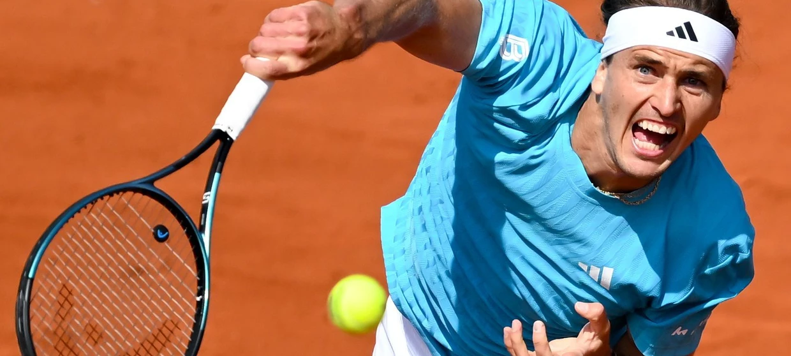

# techBasics1_LenaMarit_Busch

## List of the top 5 tennis players worldwide

1. Jannik Sinner

   extremely consistent in 2026: reached finals at Indian Wells, Miami and Monte Carlo

2. Carlos Alcaraz

   known for his explosive, attacking playing style and strong winning streaks on clay court

3. Alexander Zverev

   Germany's top player, has the potential to win more big titles if he maintains his form

4. Novak Djokovic

   still in the Top 5 at age 38, one of the greatest players in history

5. Ben Shelton

   known for his powerful serve and energetic playing style

